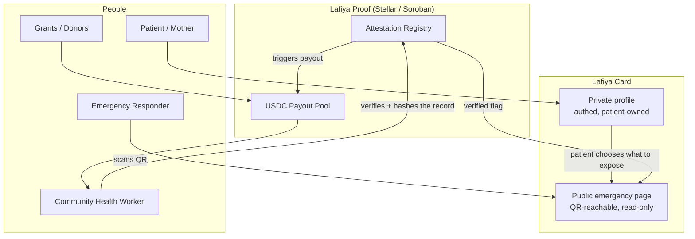

# Lafiya 🩺

[](https://stellar.org)
[](https://soroban.stellar.org)
[](#status)
[](#status)

**Your vitals, verified. When you can't speak, Lafiya does.**

Lafiya is a free, patient-owned **emergency health card**. The handful of facts that change how you are treated in an emergency — blood group, genotype, allergies, current medications, chronic conditions — travel with you as a scannable QR code, work offline, and can be **cryptographically verified** by a health worker so a first responder can trust them on the spot.

*Lafiya* is Hausa for health, safety, and wellbeing.

<a id="status"></a>

> **Status:** Pre-alpha · Stellar **testnet** · not yet audited · not a medical device. See [Disclaimer](#disclaimer).

## Overview

Lafiya pairs a minimal, patient-controlled emergency profile with a Stellar-based trust and payment layer, so the facts that matter in an emergency are both *available* and *verifiable* — without ever putting health data on-chain.

### The Problem

In Nigeria, health records are paper, siloed per facility, and effectively lost the moment a patient moves, is referred, or arrives unconscious. In an emergency, the facts that decide treatment — especially **genotype** (AS/SS sickle-cell status), blood group, and drug allergies — are usually unknown to whoever is treating you. Wrong assumptions cost lives.

This gap compounds in a specific way on the ground:

- **Patients carry nothing portable** — a paper card, if it exists, doesn't survive a move, a referral, or an emergency
- **Responders have no way to trust a claim** — even if a patient states their blood group or allergy, there is no verification a first responder can check under time pressure
- **Community health workers (CHWs) are the last-mile bottleneck** — they are best positioned to register and verify patients, but have no sustainable incentive to do it at scale
- **No existing system is both privacy-respecting and independently verifiable** — paper is unverifiable, and a plain database of health records raises exactly the centralised-honeypot problem regulators and patients are right to worry about

### What Lafiya Does

- **For the patient / mother** — a free card you carry (on your phone or printed) that speaks for you when you can't.
- **For the responder / clinician** — scan the QR, no login, and see only the decision-relevant subset, with a clear "verified" indicator you can trust.
- **For the community health worker (CHW)** — get paid in USDC on Stellar for each person you register and verify, solving the last-mile distribution problem.

## Features

- **Scannable Emergency QR**: a public, read-only page exposing only the decision-relevant subset of a patient's record — works offline, no login required for the responder
- **Patient-Controlled Profile**: the patient (or guardian) owns a private, authenticated profile and chooses exactly what appears on the public page
- **Cryptographic Attestation**: a licensed health worker verifies a record on-chain via Soroban — a hash, the attester's identity, and a timestamp, never the health data itself
- **CHW Incentive Payments**: micro-payments in USDC on Stellar reward community health workers per verified registration, funded transparently on-chain
- **Zero On-Chain PII**: Stellar holds only hashes, attestations, and payments — personal health data lives exclusively in an encrypted, access-controlled off-chain database

## Architecture



### Core Components

- **`lafiya-web`** _(planned)_: Next.js app hosting both the authenticated profile editor and the public emergency page + QR generation
- **`lafiya-contracts`** _(planned)_: Soroban smart contracts — attestation registry and attester allowlist, Rust, Testnet first
- **`lafiya-docs`** _(this repo)_: concept note, data model, threat model, privacy design, and funding/DPG materials that the other repos are built against
- **`lafiya-verifier`** _(later)_: CHW verification tool; starts as a route inside `lafiya-web` and only splits out if it grows

## Attestation & Trust Model

| Concept | What it means |
| --- | --- |
| **On-chain attestation** | A licensed, allowlisted health worker verifies a record; Soroban records a hash of the record + the attester's identity + a timestamp |
| **Off-chain data** | The full health record lives encrypted in an access-controlled database, gated by row-level security; it never touches the chain |
| **Verified indicator** | A responder's scan checks the attestation registry for a matching hash and shows a clear "verified" badge |
| **Attester allowlist** | Only registered health workers approved through governance can write attestations |
| **Incentive rails** | CHWs are paid micro-amounts of USDC on Stellar per verified registration; near-zero fees make last-mile outreach economically viable |

### Core design principle

> **No personal health data ever touches the blockchain.** Personal data lives in an encrypted, access-controlled off-chain database. Stellar holds only hashes, attestations, and payments. This is what keeps Lafiya both privacy-respecting and regulator-compatible — and it is why Stellar is a *core* component here, not a database substitute.

### Why Stellar (core, not shoehorned)

Stellar/Soroban does two things Lafiya genuinely needs and that a plain web app cannot: it makes verification **tamper-evident and independently checkable** without exposing data, and it moves **stablecoin micropayments** to health workers cheaply and across borders. Remove Stellar and the trust layer and the incentive engine both disappear.

## Data Model (emergency subset)

The public emergency page is intentionally minimal:

- Name, age, photo
- **Blood group and genotype**
- Drug allergies
- Current medications (esp. anticoagulants, insulin, anti-epileptics)
- Chronic conditions / implants
- Emergency contact(s)
- Language spoken

Everything else (full history, documents, notes) stays private, behind authentication.

## Privacy & Compliance

- **Nigeria Data Protection Act (2023)** governs all personal data held. Consent, encryption, and minimal disclosure are designed in from day one.
- Patients opt into exactly what appears on their public page.
- No health data on-chain; only non-reversible hashes and attestations.

## Repository Structure

This repository (`lafiya-docs`) holds the concept note, data model, threat model, privacy design, and funding/DPG materials for the Lafiya project. The web app and smart contracts live in separate repos — see [Lafiya Organization](#lafiya-organization) below.

```
lafiya-docs/
│
├── README.md                    ← This file: project overview and org-wide conventions
├── CONTRIBUTING.md / CODE_OF_CONDUCT.md / SECURITY.md / LICENSE
├── CHANGELOG.md
├── .github/                     ← PR/issue templates, CODEOWNERS, markdown-lint CI
└── docs/
    ├── README.md                 ← docs index — start here
    ├── concept-note.md, data-model.md, threat-model.md, privacy-design.md
    ├── data-retention-policy.md, funding-and-dpg.md, roadmap.md
    ├── personas.md, faq.md, glossary.md, style-guide.md
    ├── api-surface-sketch.md, testing-strategy.md   ← forward-looking, not yet implemented
    └── adr/                      ← Architecture Decision Records
```

## Documentation

Full documentation lives in [`docs/`](docs/README.md):

- [Concept note](docs/concept-note.md) — problem, solution, theory of change
- [Data model](docs/data-model.md) · [Threat model](docs/threat-model.md) · [Privacy design](docs/privacy-design.md) · [Data retention policy](docs/data-retention-policy.md)
- [Funding & DPG notes](docs/funding-and-dpg.md) · [Roadmap detail](docs/roadmap.md)
- [Personas](docs/personas.md) · [FAQ](docs/faq.md)
- [API & contract surface sketch](docs/api-surface-sketch.md) (forward-looking) · [Testing strategy](docs/testing-strategy.md) (forward-looking)
- [Architecture Decision Records](docs/adr/README.md)
- [Glossary](docs/glossary.md) · [Style guide](docs/style-guide.md)

See [SECURITY.md](SECURITY.md) to report a security or privacy concern about the design.

## Getting Started

*Pre-alpha; instructions land with M0.* This repo is documentation-only — there is nothing to install or run here. Once `lafiya-web` exists, it will be cloned and run like this:

```bash
git clone https://github.com/lafiya-xyz/lafiya-web
cd lafiya-web
cp .env.example .env.local   # Supabase + Stellar testnet keys
npm install
npm run dev
```

## Roadmap

- **M0 — Public card (testnet).** One patient can create a profile and expose a working read-only emergency page via QR.
- **M1 — Attestation.** Soroban registry lets an allowlisted attester verify a record; the card shows a verified indicator.
- **M2 — Incentives.** USDC-on-Stellar payout to a CHW per verified registration.
- **M3 — Pilot.** Small supervised field pilot; measure verified cards created and scan events.
- **M4 — Mainnet + funding.** Launch on mainnet; open transparent funding pool.

## Why This Matters

- **For patients** — the facts that decide emergency treatment travel with them, instead of being lost at the clinic door.
- **For responders** — a verified indicator they can trust in seconds, without needing to contact a facility or take a claim on faith.
- **For CHWs** — a sustainable, transparent, per-verification incentive instead of unpaid last-mile work.
- **For funders** — every dollar in the incentive pool maps to a countable number of verified cards, on-chain.

Lafiya is built as an open-source **Digital Public Good** (SDG 3, Good Health and Well-being).

- **Primary:** Stellar Community Fund (SCF) — Build track.
- **Bridge:** Registration against the Digital Public Goods Standard.
- **Later:** DPG-aligned and public-goods streaming funders once real-world impact is demonstrable.

## Tech Stack

- **Frontend / app:** Next.js, deployed on Vercel
- **Data & auth:** Supabase (Postgres, Row-Level Security, encryption at rest)
- **On-chain:** Soroban smart contracts (Rust) on Stellar; USDC on Stellar for payments
- **Standards:** W3C Verifiable Credentials data model; HL7 FHIR for health-data field structure

## License

This repository is licensed under **Apache-2.0** — see [LICENSE](LICENSE). Apache-2.0 is recommended organization-wide (OSI-approved, includes a patent grant — required for Digital Public Good status).

## Contributing

See [CONTRIBUTING.md](CONTRIBUTING.md) for how to propose changes, and [CODE_OF_CONDUCT.md](CODE_OF_CONDUCT.md) for community expectations. Issues and PRs are welcome now — this repo is documentation, so most contributions are proposals or corrections to the docs above, not code.

## Lafiya Organization

This project lives under the `lafiya-xyz` GitHub organization. If a change here touches a shared contract (below), call it out so the matching repo can be updated.

| Repo | Purpose | Priority |
|------|---------|----------|
| `lafiya-web` | Patient + responder web app (Next.js). Public emergency page, authed profile editor, QR generation. | **Build first** |
| `lafiya-contracts` | Soroban smart contracts (Rust): attestation registry + attester allowlist. Testnet first. | **Build next** |
| `lafiya-docs` _(this repo)_ | Concept note, data model, threat model, privacy design, funding/DPG materials, references. | Start now (lightweight) |
| `.github` | Organization profile README and contribution guidelines. | Start now |
| `lafiya-verifier` | CHW verification tool. Begins as a route inside `lafiya-web`; split out only if it grows. | Later |

> Resist scaffolding empty repos. Two working repos (`lafiya-web`, `lafiya-contracts`) beat five half-built ones. Build one honest milestone at a time.

### Data Flow

```
lafiya-docs ──(data model, threat model, privacy design)──▶  lafiya-web
                                                                  │
                                                     patient profile + QR
                                                                  │
                            lafiya-contracts (Soroban) ◀── attestation hash ── CHW verifies record
                                     │
                                     ▼
                          verified flag on public page
                                     │
                                     ▼
                          USDC payout to CHW (on Stellar)
```

1. **`lafiya-docs`** (this repo) defines the emergency data model, threat model, and privacy design that the other repos build against.
2. **`lafiya-web`** implements the patient profile, the public emergency page, and QR generation, following the data model above.
3. A CHW verifies a record; **`lafiya-contracts`** records the attestation on Soroban (hash + attester identity + timestamp only).
4. The public emergency page reflects the verified flag once the attestation lands.
5. Verified registrations trigger a USDC-on-Stellar payout to the CHW from the transparent funding pool.

### Shared Contracts (must stay in sync across repos, once they exist)

- **Emergency data model** — the field list under [Data Model](#data-model-emergency-subset) above is the source of truth; `lafiya-web`'s profile schema must mirror it field-for-field.
- **Attestation record shape** — hash of record + attester identity + timestamp; to be formally specified in this repo before `lafiya-contracts` implements the Soroban struct.
- **Environment/config keys** — none exist yet; the first will be Supabase and Stellar testnet keys needed by `lafiya-web` (see [Getting Started](#getting-started)).

### Conventions for AI Agents

- Treat this section as the source of truth for **cross-repo** contracts. Each repo's own README covers repo-local conventions once it exists.
- This repo currently contains **documentation only** — do not assume application or contract code lives here.
- No personal health data, secrets, or private keys belong in this repo, ever — only specs, models, and public materials.

## Disclaimer

Lafiya is an information aid, **not a medical device** and **not a substitute for professional medical judgment**. Verified indicators reflect that a record was attested by a registered health worker; they are not a clinical guarantee. Treatment decisions remain the responsibility of the attending clinician.

## References

These works directly informed Lafiya's design and are the intended reading for contributors.

**Books**

- Shortliffe, E. H., & Cimino, J. J. (Eds.). (2021). *Biomedical Informatics: Computer Applications in Health Care and Biomedicine* (5th ed.). Springer. — Grounds the clinical data model: which fields are decision-relevant in an emergency, and how health records are structured and coded.
- Preukschat, A., & Reed, D. (2021). *Self-Sovereign Identity: Decentralized Digital Identity and Verifiable Credentials*. Manning. — The blueprint for Lafiya Proof: issuer/holder/verifier roles, verifiable credentials, hash-based attestation, key management, and offline verification.
- Toyama, K. (2015). *Geek Heresy: Rescuing Social Change from the Cult of Technology*. PublicAffairs. — Keeps the project honest: technology amplifies human capacity rather than replacing it, which is why Lafiya centers community health workers, not the app.
- Kleppmann, M. (2017). *Designing Data-Intensive Applications*. O'Reilly. — Informs the off-chain data layer: reliable and secure storage, encryption, and the boundary between what lives in the database and what is anchored on-chain.
- Martin, R. C. (2017). *Clean Architecture: A Craftsman's Guide to Software Structure and Design*. Prentice Hall. — Discipline for an AI-assisted codebase: clear boundaries so the app, the contracts, and the data layer stay independently maintainable.

**Standards & documentation**

- Stellar Development Foundation — Stellar and Soroban developer documentation.
- W3C — Verifiable Credentials Data Model.
- HL7 — FHIR (health-data interoperability standard).
- Nigeria Data Protection Act (2023) — Nigeria Data Protection Commission.
- Digital Public Goods Alliance — DPG Standard.

---

<div align="center">

**Lafiya** — Your vitals, verified.

_Built for the Stellar ecosystem. Open source. Community owned._

</div>
